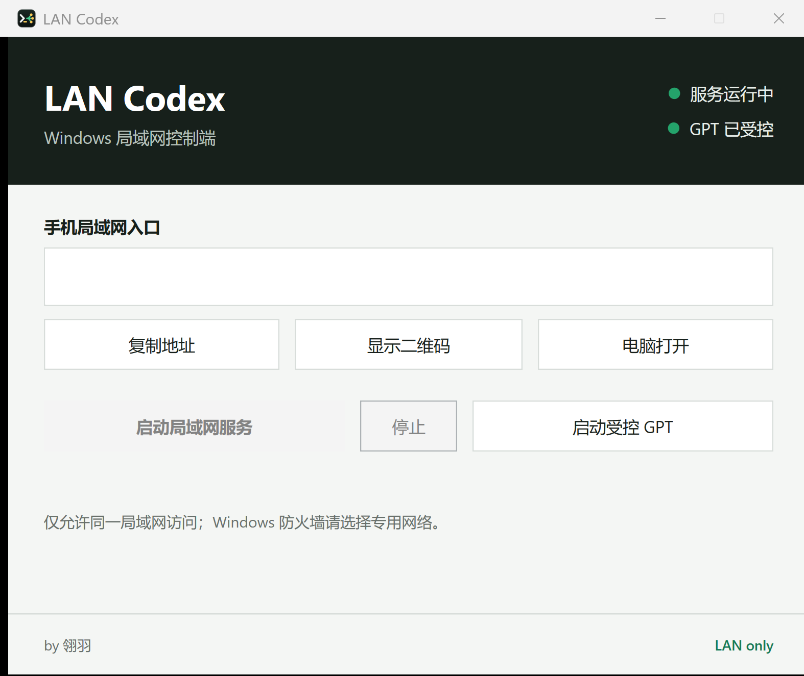
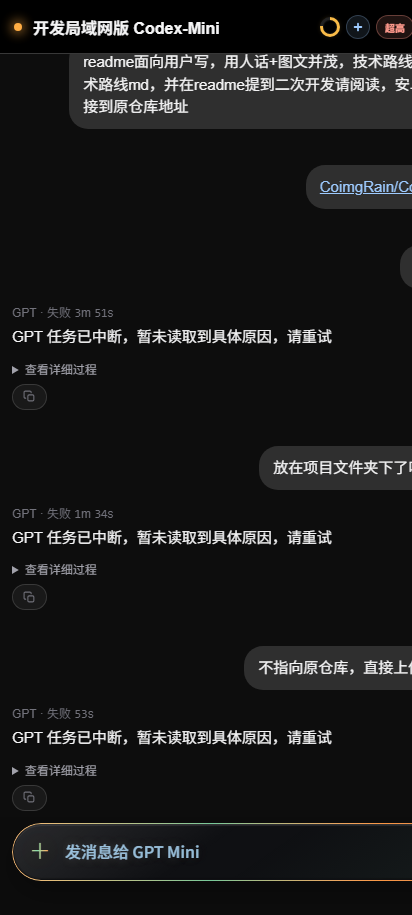

# LAN Codex

**by 翎羽**

在电脑上运行 Codex，在手机上继续看对话、发消息和传文件。电脑和手机连接同一个局域网即可使用，不需要把对话经过额外的中转服务器。

## 界面预览

  

  

## 下载

- Windows 电脑：[下载 LAN Codex 安装包](https://github.com/Yi-Lings/LAN-Codex/releases/download/v1.0.3/LAN-Codex-Setup-1.0.3.exe)
- Android 手机：[下载 Lan-gpt.apk](https://github.com/Yi-Lings/LAN-Codex/releases/latest/download/Lan-gpt.apk)
- 查看全部版本：[GitHub Releases](https://github.com/Yi-Lings/LAN-Codex/releases)

Windows 安装包已带好运行环境，普通用户不需要另外安装 Node.js。手机也可以直接扫描电脑端显示的二维码，用浏览器打开；Android APK 是可选的。

> **Android 升级提醒：** 新版 APK 使用 LAN Codex 自有签名。安装过原版 GPT Mini APK 的用户，需要先卸载旧版，再安装这里下载的 `Lan-gpt.apk`。

## 三步开始使用

### 1. 安装并打开电脑端

运行下载好的 `LAN-Codex-Setup-1.0.3.exe`，按提示完成安装，然后从桌面或开始菜单打开 **LAN Codex**。

第一次启动时，如果 Windows 防火墙询问是否允许访问，请只勾选“专用网络”。

### 2. 启动连接

在 LAN Codex 控制面板中点击“启动局域网服务”，再点击“启动受控 GPT”。

启动受控 GPT 时，当前 ChatGPT/Codex 窗口会关闭后重新打开，这是正常现象。操作前请先处理尚未发送的文字。

### 3. 用手机连接

让手机和电脑连接同一个 Wi-Fi，在电脑端点击“显示二维码”，然后用手机扫码打开。Android 用户也可以安装 `Lan-gpt.apk`，连接时以电脑端显示的局域网地址或二维码为准。

连接成功后，就可以在手机上查看对话、发送消息和传送文件。

## 如何卸载

打开 Windows“设置” → “应用” → “已安装的应用”，找到 **LAN Codex** 并点击“卸载”。也可以使用开始菜单中的 **Uninstall LAN Codex**，或安装目录里的 `unins000.exe`。

卸载程序会停止局域网服务，并移除 LAN Codex 创建的防火墙规则。

## 常见问题

### 手机扫码后打不开

先确认手机和电脑连接的是同一个 Wi-Fi。访客网络、公司网络或开启了“设备隔离”的路由器，可能会禁止设备互相访问。还可以检查 Windows 当前网络是否设为“专用网络”，然后在电脑端停止并重新启动局域网服务。

### 手机能打开页面，但看不到 Codex 对话

确认电脑端同时显示“服务运行中”和“GPT 已受控”。如果 GPT 未受控，点击“启动受控 GPT”，等待 ChatGPT/Codex 重新打开后再刷新手机页面。

### Windows 提示端口被占用

关闭其他正在使用 `8787` 端口的程序，或退出 LAN Codex 后重新打开。不要同时运行多个 LAN Codex 实例。

### Android 提示无法安装 APK

请确认 APK 是从本项目 GitHub Releases 下载的。如果手机已安装原版 GPT Mini，请先卸载原版；两者签名不同，不能直接覆盖安装。部分手机还需要临时允许浏览器或文件管理器“安装未知应用”，安装完成后可以关闭这项权限。

### 安装后不想继续使用

直接按上面的卸载方法移除即可，不需要手动删除文件或防火墙规则。

## 隐私与局域网说明

LAN Codex 的手机连接只在电脑本机和局域网内工作，不提供公网中转。ChatGPT/Codex 桌面应用本身仍需要正常联网，并继续受其官方服务条款和隐私政策约束。

电脑端显示的地址和二维码带有访问凭证，请不要发给不信任的人，也不要公开截图。离开可信 Wi-Fi 时，建议在控制面板中停止局域网服务。

## 二次开发

需要了解项目结构、运行流程、构建方式或进行二次开发，请阅读 [TECHNICAL_ROUTE.md](TECHNICAL_ROUTE.md)。

## 许可证

本项目公开源代码，并按仓库中的许可文件发布。使用、修改或再分发前，请阅读 [LICENSE](LICENSE) 与 [NOTICE.md](NOTICE.md)；非商业使用限制和法定归属以这两个文件为准。
